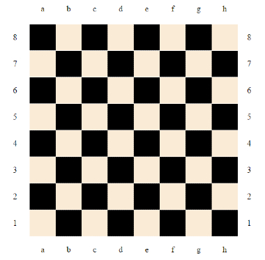

# Chessboard

## Description

The chessboard bellow has 64 squares, 8 rows and 8 columns. Each row is labeled from 1 to 8 and each column is labeled from a to h (lowercase).  
A square is located at the intersection of a row and of a column, like square 2C it's the intersection of the row 2 and column C.



Positioning a pawn to a starting square, you need to find out where it will be the end square after moving it R times (rows) vertically to the top and C times (columns) horizontally to the right. If during the moves the pawn reaches the end of the board, it will start again from the opposite direction like in the examples below.

#### INPUT
```
string    startPosition
number    rows
number    columns
```

#### OUTPUT
```
string    endPosition
```

#### EXAMPLE 1
**Input**
```
startPosition: 2b, rows: 3, columns: 2
```

**Output**
```
5d
```

#### EXAMPLE 2
**Input**
```
startPosition: 5h, rows: 11, columns: 25
```

**Output**
```
8a
```

Solved in Java.
